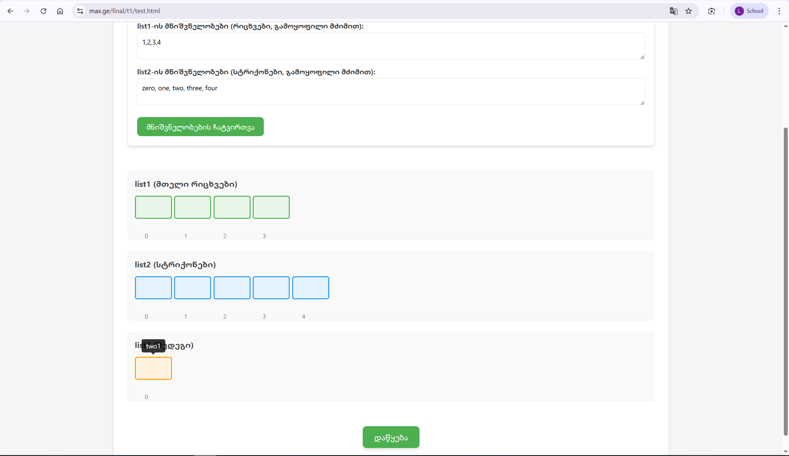

# FinalTask - Java List Transformation

## Overview

This Java program transforms two input lists (`list1` and `list2`) into a third list (`list3`) based on a custom mapping algorithm.

- **`list1`**: A list of integers.
- **`list2`**: A list of strings.
- **`list3`**: Resulting list of strings after transformation.

---

## Algorithm Description

1. For each value in `list1`, calculate a **mapped index** by adding 1:  
   `mappedIndex = value + 1`

2. If the mapped index is within bounds of `list2`:
   - Retrieve the string at `list2[mappedIndex]`
   - Concatenate this string with the original value from `list1`
   - Add the concatenated result to `list3`

3. After building `list3`, **only keep the element that was added from the first index of `list1`** (i.e., the element corresponding to `list1[0]`).

4. Remove all other elements from `list3`.

---

## Error Handling

- Negative values in `list1` are **skipped** and reported with a warning message.
- Values in `list1` that result in a mapped index outside the bounds of `list2` are **skipped** and reported.
- This prevents `IndexOutOfBoundsException` and ensures only valid mappings are processed.

---
Screenshot of Error Handling

## Example

### Input:

```text
list1 = [1, 2, 3, 4]
list2 = ["zero", "one", "two", "three", "four"]

#### Output
List3 before removal: [two1, three2, four3]
List3 after removal: [two1]
 
 


